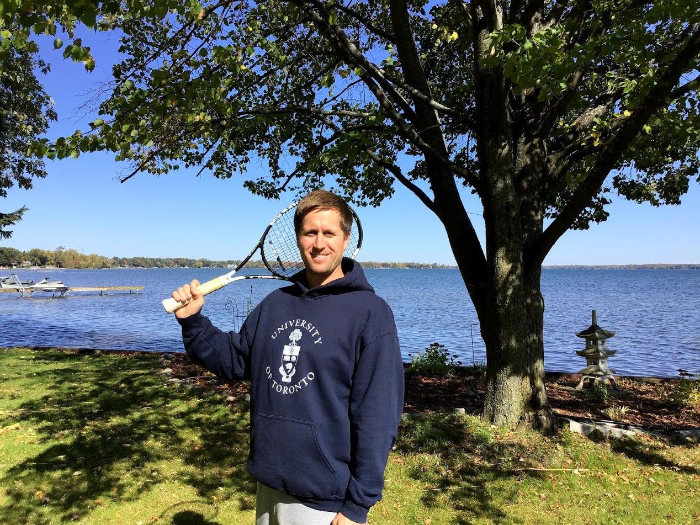

# Bio

<figure>
    
</figure>
<!-- { width="500" } -->

&emsp;I recently graduated from the *University of Toronto* St. George
(downtown) campus with an HBSc in **Computer Science**. My favorite
topics in CS include **computer graphics**, game design, and operating
systems. Throughout my studies I have acquired great problem solving
skills and have gained experience with a variety of programming
languages and software tools. Currently, my language of choice is
the **Rust** programming language. The more I learn about Rust, the
more I love this language; it's absolutely brilliant!

On a personal level, I'm a well-rounded individual who enjoys playing racket
sports such as tennis, badminton, pickleball, and table tennis. I also
enjoy paddleboarding, working out, and maintaining a healthy lifestyle.

## Courses
* CSC108: Introduction to Computer Programming (Python)
* MAT137: Calculus I (Full year)
* CSC148: Introduction to Computer Science (Python)
* CSC165: Mathematical Expression and Reasoning for Computer Science
* CSC207: Software Design (Java)
* CSC209: Software Tools and Systems Programming (C)
* MAT223: Linear Algebra I
* MAT235: Multivariable Calculus (Full year)
* CSC236: Theory of Computation
* MAT244: Ordinary Differential Equations
* PHL245: Modern Symbolic Logic
* STA247: Probability with Computer Applications
* CSC258: Computer Organization (Verilog)
* CSC263: Data Structures and Analysis
* CSC309: Programming on the Web (Javascript)
* CSC318: The Design of Interactive Computational Media
* CSC343: Databases (SQL)
* CSC367: Parallel Programming (C/C++)
* CSC369: Operating Systems (C)
* CSC373: Algorithm Design, Analysis & Complexity
* CSC384: Artificial Intelligence (Python)
* CSC404: Video Game Design (Unity/C#) 
* CSC417: Physics-based Animation (C++)
* CSC418: Computer Graphics (C++)
* CSC419: Geometry Processing (C++)
